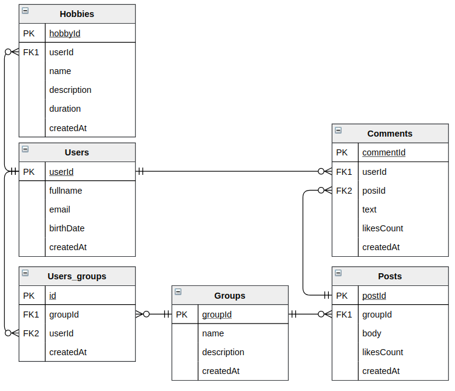

## A social network

#### 1. Database ERD

#### 2. Access patterns (questions to database)
- get user details (user info and hobbies)
- get comments for user
- get groups for user
- get posts for group by status
- get single group with posts
- get sent posts

#### 3. Define primary and sort keys

| Entities        | PK                          | SK                               |
| --------------- |:----------------------------|:---------------------------------|
| user            | USER#&lt;userId&gt;         | DETAILS#&lt;userId&gt;           |
| user hobby      | -                           | -                                |
| user group      | USER#&lt;userId&gt;         | GROUP#&lt;groupId&gt;            |
| group           | GROUP#&lt;groupId&gt;       | DETAILS#&lt;groupId&gt;          |
| post            | GROUP#&lt;groupId&gt;       | POST#&lt;postId&gt;              |
| comment         | COMMENT#&lt;commentId&gt;   | POST#&lt;postId&gt;              |
| comment users   | COMMENT#&lt;commentId&gt;   | USER#&lt;userId&gt;              |

##### One-to-many patterns:
 - denormalization (attribute)
 - Primary key + query
 - A secondary index (ex. inverted) + query
 
##### Filtering access patterns:
- composite sort key: combine two attributes + query 
- sparse index: add unique attribute to item -> make it PK -> query 

 
##### Many-to-many:
- some pattern

##### Choosing an index
[Local or global: Choosing a secondary index type in DynamoDB](https://www.dynamodbguide.com/local-or-global-choosing-a-secondary-index-type-in-dynamo-db)

