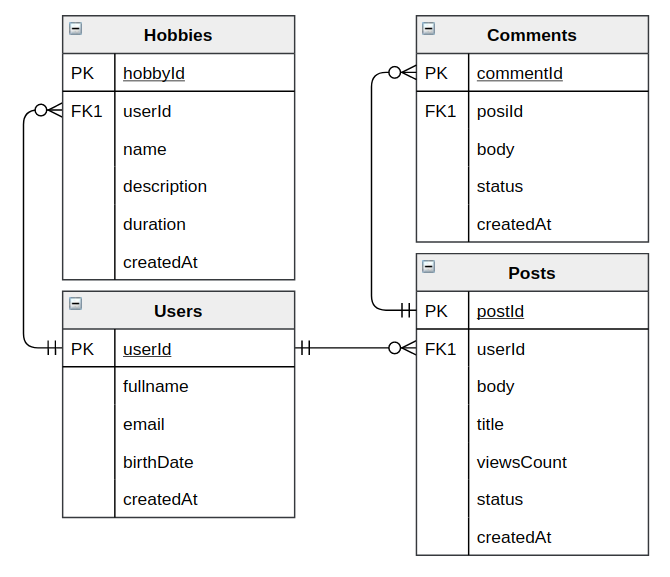

## Notes (aka Google Keep):
- u users
- up users profile (1u-1u)
- c categories (1u-*c)
- n notes (1c-*n)
- l labels (*n-*l)

## E-commerce:
- u users
- p users profile (1u-1p)
- o orders (1u-*o)
- i items (1o-*i)

## A social network

ERD

#### Access patterns (questions):
- get user profile
- get orders for user
- get single order with items
- get orders for user by status
- get open orders

##### One-to-many patterns:
 - denormalization (attribute)
 - Primary key + query
 - A secondary index (ex. inverted) + query
 
##### Filtering access patterns:
- composite sort key: combine two attributes + query 
- sparse index: add unique attribute to item -> make it PK -> query 

 
##### Many-to-many:
- some pattern

##### Choosing an index
[Local or global: Choosing a secondary index type in DynamoDB](https://www.dynamodbguide.com/local-or-global-choosing-a-secondary-index-type-in-dynamo-db)

